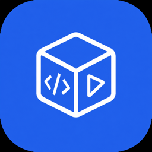

<div align="center">
  
  <h1>Cloud CLI (aka Claude Code UI)</h1>
  <p>A desktop and mobile UI for <a href="https://docs.anthropic.com/en/docs/claude-code">Claude Code</a>, <a href="https://docs.cursor.com/en/cli/overview">Cursor CLI</a>, <a href="https://developers.openai.com/codex">Codex</a>, <a href="https://geminicli.com/">Gemini-CLI</a>, Antigravity CLI, and OpenCode.<br>Use it locally or remotely to view your active projects and sessions from everywhere.</p>
</div>

## Screenshots

<div align="center">
  
<table>
<tr>
<td align="center">
<h3>Desktop View</h3>

<br>
<em>Main interface showing project overview and chat</em>
</td>
<td align="center">
<h3>Mobile Experience</h3>

<br>
<em>Responsive mobile design with touch navigation</em>
</td>
</tr>
<tr>
<td align="center" colspan="2">
<h3>CLI Selection</h3>

<br>
<em>Select between Claude Code, Gemini, Cursor CLI, Codex, Antigravity, and OpenCode</em>
</td>
</tr>
</table>


</div>

## Features

- **Responsive Design** - Works seamlessly across desktop, tablet, and mobile so you can also use Agents from mobile 
- **Interactive Chat Interface** - Built-in chat interface for seamless communication with the Agents
- **Integrated Shell Terminal** - Direct access to the Agents CLI through built-in shell functionality
- **File Explorer** - Interactive file tree with syntax highlighting and live editing
- **Git Explorer** - View, stage and commit your changes. You can also switch branches 
- **Browser Use** - Open browser sessions for web research, testing, and agent-driven browser tasks
- **Session Management** - Resume conversations, manage multiple sessions, and track history
- **Plugin System** - Extend MCP Playground with custom plugins — add new tabs, backend services, and integrations. [Build your own →](https://github.com/cloudcli-ai/cloudcli-plugin-starter)
- **TaskMaster AI Integration** *(Optional)* - Advanced project management with AI-powered task planning, PRD parsing, and workflow automation
- **Model Compatibility** - Works with Claude, GPT, Gemini, Antigravity, and OpenCode model catalogs (the full list of supported models is available at runtime via `GET /api/providers/:provider/models`)


## Quick Start

##### macOS/Linux Launcher

App Launcher:
```bash
cd /path/to/mcp
./launch.sh
```
Navigate to http://<laptop-ip>:5111

Install as a Service:
```bash
cd /path/to/mcp
./install.sh
```
Navigate to http://<laptop-ip>:5111

Install Local AI Models for opencode/offline data usage:
```bash
cd /path/to/mcp
./local-ai.sh
```

## Detailed Starting Guides:

##### macOS/Linux Launcher

```bash
cd /path/to/mcp
./launch.sh
```

The launcher selects Node.js 22 from nvm, Homebrew, or a user-local download, creates `.env` when needed, installs npm dependencies, installs missing agent CLIs, and starts the dev server. Use `./launch.sh --service` to install a user service, or `./launch.sh --agent-clis-only --strict-agent-clis` to install/verify only the agent CLIs.

##### macOS Local Run

```bash
cd /path/to/mcp

# If nvm is installed:
nvm install 22
nvm use 22

# If nvm is not installed, use Homebrew Node 22 instead:
brew install node@22
export PATH="/opt/homebrew/opt/node@22/bin:$PATH"      # Apple Silicon
# export PATH="/usr/local/opt/node@22/bin:$PATH"       # Intel Homebrew
hash -r

node -v
cp .env.example .env
npm install
npm run dev
```

`node -v` must print `v22.x` before `npm install` and before `npm run dev`.

Default source-run URLs from `.env.example`:

```text
Frontend: http://localhost:5173
Backend:  http://localhost:3221
Health:   http://localhost:3221/health
```

Local source runs disable username/password auth by default and bind to `127.0.0.1`. To re-enable login/setup, set both flags before starting the app:

```bash
DISABLE_AUTH=false
VITE_DISABLE_AUTH=false
```

If you change `VITE_DISABLE_AUTH`, rebuild or restart the Vite dev server so the browser bundle receives the new value.

If startup fails with a native module error such as `better_sqlite3.node was compiled against a different Node.js version`, switch to Node 22 and rebuild the native dependencies:

```bash
export PATH="/opt/homebrew/opt/node@22/bin:$PATH"
hash -r
node -v
npm rebuild better-sqlite3 node-pty bcrypt sharp
npm run dev
```

If rebuild still fails because dependencies were installed under another Node major, recreate the local dependency tree under Node 22:

```bash
rm -rf node_modules
npm install
npm run dev
```

`./launch.sh` installs missing agent CLIs by default for local macOS/Linux source runs: Claude Code (`claude`), Codex (`codex`), Gemini CLI (`gemini`), Antigravity (`agy`), OpenCode (`opencode`), and Cursor CLI (`cursor-agent`). Use `--agent-clis-only` for a CLI-only bootstrap, `--no-agent-cli-install` to skip that bootstrap, `--upgrade-agent-clis` to re-run installers, or `--strict-agent-clis` to fail startup if any CLI is still missing.

Authenticate the CLIs you plan to use. Missing providers should report installation or authentication status without blocking the rest of the app unless strict launcher mode is enabled.

```bash
claude --version
codex --version
gemini --version
agy --version
opencode --version
cursor-agent --version
```

Optional local provider overrides:

```bash
CLAUDE_CLI_PATH=claude
CURSOR_AGENT_PATH=cursor-agent
GEMINI_PATH=gemini
ANTIGRAVITY_PATH=agy
OPENCODE_PATH=opencode
OPENCODE_CONFIG=/path/to/opencode.json
```

OpenCode local models can come from `./opencode.json` generated by `./local-ai.sh`, `~/opencode.json`, `~/.config/opencode/opencode.json`, or `~/.config/opencode/opencode.jsonc`. Ollama-backed IDs such as `ollama/qwen3-coder:latest` are read from that config and shown in the model picker.

#### Run Persistently

Run persistent services as your own user. The agent providers read user-scoped auth and config from paths such as `~/.claude`, `~/.codex`, `~/.gemini`, and `~/.local/share/opencode`.

Build the production server first:

```bash
cd /path/to/mcp

# Use Node 22 with nvm or Homebrew before installing/building.
export PATH="/opt/homebrew/opt/node@22/bin:$PATH"
hash -r
node -v

npm install
npm run build
```

Use `HOST=0.0.0.0` when the dev server should be reachable from another browser, VM, or device on the same development network.

##### Linux: systemd User Service

Create `~/.config/systemd/user/cloudcli-mcp.service`:

```ini
[Unit]
Description=MCP Playground
After=network-online.target

[Service]
Type=simple
WorkingDirectory=/home/YOUR_USER/Code/mcp
EnvironmentFile=/home/YOUR_USER/Code/mcp/.env
Environment=PATH=/home/YOUR_USER/.local/bin:/home/YOUR_USER/.opencode/bin:/home/YOUR_USER/.nvm/versions/node/v22/bin:/usr/local/bin:/usr/bin:/bin
ExecStart=/home/YOUR_USER/.nvm/versions/node/v22/bin/node dist-server/server/index.js
Restart=on-failure
RestartSec=5

[Install]
WantedBy=default.target
```

Enable and start it:

```bash
systemctl --user daemon-reload
systemctl --user enable --now cloudcli-mcp.service
loginctl enable-linger "$USER"
```

Check status and logs:

```bash
systemctl --user status cloudcli-mcp.service
journalctl --user -u cloudcli-mcp.service -f
curl http://127.0.0.1:3221/health
```

##### macOS: launchd Login Agent

Build with Node 22 first, then use the same Node executable in the login agent. Homebrew paths are stable across patch updates:

```bash
/opt/homebrew/opt/node@22/bin/node -v      # Apple Silicon
/usr/local/opt/node@22/bin/node -v         # Intel Homebrew
```

Create `~/Library/LaunchAgents/com.mcp-playground.local.plist`:

```xml
<?xml version="1.0" encoding="UTF-8"?>
<!DOCTYPE plist PUBLIC "-//Apple//DTD PLIST 1.0//EN"
 "http://www.apple.com/DTDs/PropertyList-1.0.dtd">
<plist version="1.0">
  <dict>
    <key>Label</key>
    <string>com.mcp-playground.local</string>

    <key>WorkingDirectory</key>
    <string>/Users/YOUR_USER/Code/mcp</string>

    <key>ProgramArguments</key>
    <array>
      <string>/opt/homebrew/opt/node@22/bin/node</string>
      <string>dist-server/server/index.js</string>
    </array>

    <key>EnvironmentVariables</key>
    <dict>
      <key>PATH</key>
      <string>/Users/YOUR_USER/.local/bin:/Users/YOUR_USER/.opencode/bin:/opt/homebrew/opt/node@22/bin:/opt/homebrew/bin:/usr/local/bin:/usr/bin:/bin:/usr/sbin:/sbin</string>
      <key>SERVER_PORT</key>
      <string>3221</string>
      <key>VITE_PORT</key>
      <string>5173</string>
      <key>HOST</key>
      <string>127.0.0.1</string>
      <key>DISABLE_AUTH</key>
      <string>true</string>
      <key>VITE_DISABLE_AUTH</key>
      <string>true</string>
      <key>CLAUDE_CLI_PATH</key>
      <string>claude</string>
      <key>CURSOR_AGENT_PATH</key>
      <string>cursor-agent</string>
      <key>GEMINI_PATH</key>
      <string>gemini</string>
      <key>ANTIGRAVITY_PATH</key>
      <string>agy</string>
      <key>OPENCODE_PATH</key>
      <string>opencode</string>
    </dict>

    <key>RunAtLoad</key>
    <true/>
    <key>KeepAlive</key>
    <true/>

    <key>StandardOutPath</key>
    <string>/tmp/mcp-playground.out.log</string>
    <key>StandardErrorPath</key>
    <string>/tmp/mcp-playground.err.log</string>
  </dict>
</plist>
```

On Intel Macs, replace `/opt/homebrew/opt/node@22/bin/node` with `/usr/local/opt/node@22/bin/node`, and replace the first two PATH entries with `/usr/local/opt/node@22/bin:/usr/local/bin`.

Load and start it:

```bash
launchctl bootout gui/$(id -u) ~/Library/LaunchAgents/com.mcp-playground.local.plist 2>/dev/null || true
launchctl bootstrap gui/$(id -u) ~/Library/LaunchAgents/com.mcp-playground.local.plist
launchctl kickstart -k gui/$(id -u)/com.mcp-playground.local
curl http://127.0.0.1:3221/health
```

Check status and logs:

```bash
launchctl print gui/$(id -u)/com.mcp-playground.local
tail -f /tmp/mcp-playground.err.log
```


---

## Which option is right for you?

MCP Playground UI is the open source UI layer that powers MCP Playground Cloud. You can self-host it on your own machine, run it in a Docker sandbox for isolation, or use MCP Playground Cloud for a fully managed environment.

| | Self-Hosted (npm) | Self-Hosted (Docker Sandbox) *(Experimental)* | MCP Playground Cloud |
|---|---|---|---|
| **Best for** | Local agent sessions on your own machine | Isolated agents with web/mobile IDE | Teams who want agents in the cloud |
| **How you access it** | Browser via `[yourip]:port` | Browser via `localhost:port` | Browser, any IDE, REST API, n8n |
| **Setup** | `npx @cloudcli-ai/cloudcli` | `npx @cloudcli-ai/cloudcli@latest sandbox ~/project` | No setup required |
| **Isolation** | Runs on your host | Hypervisor-level sandbox (microVM) | Full cloud isolation |
| **Machine needs to stay on** | Yes | Yes | No |
| **Mobile access** | Any browser on your network | Any browser on your network | Any device, native app coming |
| **Agents supported** | Claude Code, Cursor CLI, Codex, Gemini CLI, Antigravity CLI, OpenCode | Claude Code, Codex, Gemini CLI | Claude Code, Cursor CLI, Codex, Gemini CLI, Antigravity CLI, OpenCode |
| **File explorer and Git** | Yes | Yes | Yes |
| **MCP configuration** | Synced with `~/.claude` | Managed via UI | Managed via UI |
| **REST API** | Yes | Yes | Yes |
| **Team sharing** | No | No | Yes |
| **Platform cost** | Free, open source | Free, open source | Starts at $7/month |

> All options use your own AI subscriptions (Claude, Cursor, etc.) — MCP Playground provides the environment, not the AI.

---

## Security & Tools Configuration

**🔒 Important Notice**: All Claude Code tools are **disabled by default**. This prevents potentially harmful operations from running automatically.

### Enabling Tools

To use Claude Code's full functionality, you'll need to manually enable tools:

1. **Open Tools Settings** - Click the gear icon in the sidebar
2. **Enable Selectively** - Turn on only the tools you need
3. **Apply Settings** - Your preferences are saved locally

<div align="center">


*Tools Settings interface - enable only what you need*

</div>

**Recommended approach**: Start with basic tools enabled and add more as needed. You can always adjust these settings later.

---

## Plugins

MCP Playground has a plugin system that lets you add custom tabs with their own frontend UI and optional Node.js backend. Install plugins from git repos directly in **Settings > Plugins**, or build your own.

### Available Plugins

| Plugin | Description |
|---|---|
| **[Project Stats](https://github.com/cloudcli-ai/cloudcli-plugin-starter)** | Shows file counts, lines of code, file-type breakdown, largest files, and recently modified files for your current project |
| **[Web Terminal](https://github.com/cloudcli-ai/cloudcli-plugin-terminal)** | Full xterm.js terminal with multi-tab support |
| **[Claude Watch](https://github.com/satsuki19980613/cloudcli-claude-watch)** | Watches long-running Claude Code sessions for hangs and exposes process controls |
| **[MCP Playground Scheduler](https://github.com/grostim/cloudcli-cron)** | Create workspace-scoped scheduled prompts and execute them through a local CLI such as Codex, Claude Code, or Gemini CLI |
| **[PRISM MCP Playground](https://github.com/jakeefr/cloudcli-plugin-prism)** | Session intelligence for Claude Code inside MCP Playground, including token burn visibility |
| **[Sessions](https://github.com/strykereye2/cloudcli-plugin-session-manager)** | View, manage, and kill active Claude Code sessions |
| **[Token Cost Calculator](https://github.com/NightmareAway/cloudcli-plugin-token-cost-calculator)** | Calculate API costs from model prices and token usage, with preset model pricing support |
| **[Task Queue](https://github.com/TadMSTR/cloudcli-plugin-task-queue)** | Task queue dashboard to view, filter, and launch agent tasks |
| **[GitHub Issues Board](https://github.com/szmidtpiotr/claude-github-issue)** | Kanban board for GitHub Issues with bidirectional TaskMaster sync and /github-task CLI skill auto-install |

### Build Your Own

**[Plugin Starter Template →](https://github.com/cloudcli-ai/cloudcli-plugin-starter)** — fork this repo to create your own plugin. It includes a working example with frontend rendering, live context updates, and RPC communication to a backend server.

**[Plugin Documentation →](https://cloudcli.ai/docs/plugin-overview)** — full guide to the plugin API, manifest format, security model, and more.

---
## FAQ

<details>
<summary>How is this different from Claude Code Remote Control?</summary>

Claude Code Remote Control lets you send messages to a session already running in your local terminal. Your machine has to stay on, your terminal has to stay open, and sessions time out after roughly 10 minutes without a network connection.

MCP Playground UI and MCP Playground Cloud extend Claude Code rather than sit alongside it — your MCP servers, permissions, settings, and sessions are the exact same ones Claude Code uses natively. Nothing is duplicated or managed separately.

Here's what that means in practice:

- **All your sessions, not only one** — MCP Playground UI auto-discovers every session from your `~/.claude` folder. Remote Control only exposes the single active session to make it available in the Claude mobile app.
- **Your settings are your settings** — MCP servers, tool permissions, and project config you change in MCP Playground UI are written directly to your Claude Code config and take effect immediately, and vice versa.
- **Works with more agents** — Claude Code, Cursor CLI, Codex, Gemini CLI, Antigravity CLI, and OpenCode, beyond Claude Code.
- **Full UI, not only a chat window** — file explorer, Git integration, MCP management, and a shell terminal are all built in.
- **MCP Playground Cloud runs in the cloud** — close your laptop, the agent keeps running. No terminal to babysit, no machine to keep awake.

</details>

<details>
<summary>Do I need to pay for an AI subscription separately?</summary>

Yes. MCP Playground provides the environment, not the AI. You bring your own Claude, Cursor, Codex, Gemini, Antigravity, or OpenCode subscription and credentials. MCP Playground Cloud starts at $7/month for the hosted environment on top of that.

</details>

<details>
<summary>Can I use MCP Playground UI on my phone?</summary>

Yes. For self-hosted, run the server on your machine and open `[yourip]:port` in any browser on your network. For MCP Playground Cloud, open it from any device — no VPN, no port forwarding, no setup. A native app is also in the works.

</details>

<details>
<summary>Will changes I make in the UI affect my local Claude Code setup?</summary>

Yes, for self-hosted. MCP Playground UI reads from and writes to the same `~/.claude` config that Claude Code uses natively. MCP servers you add via the UI show up in Claude Code immediately and vice versa.

</details>

## Acknowledgments

### Built With
- **[Claude Code](https://docs.anthropic.com/en/docs/claude-code)** - Anthropic's official CLI
- **[Cursor CLI](https://docs.cursor.com/en/cli/overview)** - Cursor's official CLI
- **[Codex](https://developers.openai.com/codex)** - OpenAI Codex
- **[Gemini-CLI](https://geminicli.com/)** - Google Gemini CLI
- **Antigravity CLI** - Local `agy` provider integration
- **OpenCode** - Local OpenCode provider integration
- **[React](https://react.dev/)** - User interface library
- **[Vite](https://vitejs.dev/)** - Fast build tool and dev server
- **[Tailwind CSS](https://tailwindcss.com/)** - Utility-first CSS framework
- **[CodeMirror](https://codemirror.net/)** - Advanced code editor
- **[TaskMaster AI](https://github.com/eyaltoledano/claude-task-master)** *(Optional)* - AI-powered project management and task planning

<div align="center">
  <strong>Made with care for the Claude Code, Cursor, Codex, Gemini, Antigravity, and OpenCode community.</strong>
</div>
